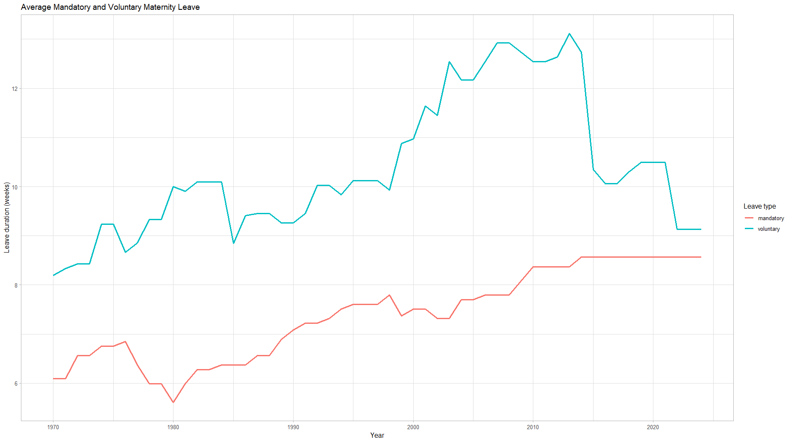
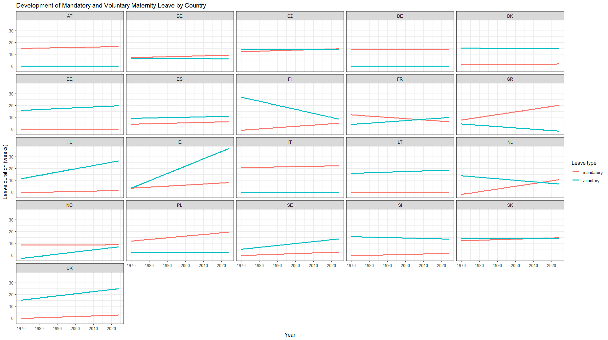

```{r setup, include=FALSE}
source("code/1_Setup.R")
source("code/2_EDA.R")
source("code/3_Correlation.R")
source("code/4_Model.R")
```

## Introduction

Maternity leave policies are a central component of modern welfare states, aiming to protect the health of mothers and children while supporting women's participation in the labor market. Across Europe, these policies vary substantially in terms of duration, compensation, and job protection. This variation provides a valuable context for analyzing how institutional frameworks shape social and economic outcomes.

Understanding maternity leave is particularly important in light of ongoing discussions about gender equality, labor shortages, and demographic change. Differences in national policies allow for meaningful comparisons and offer insights into how policy design influences both individual behavior and broader labor market dynamics.


## Institutional Background

Maternity leave policies typically differ along three key dimensions:

- **Duration**: The length of time mothers are entitled to take leave after childbirth\
- **Compensation**: The proportion of wages replaced during leave\
- **Job Protection**: The extent to which employment is guaranteed upon return

At the European level, directives set minimum standards for maternity protection. However, individual countries retain significant autonomy in implementation, resulting in considerable cross-national variation. Some countries provide generous, well-paid leave, while others offer shorter or less compensated periods.

This diversity makes Europe an ideal setting to study how policy differences impact labor market outcomes and gender equality.

## Empirical Motivation

The variation in maternity leave policies across European countries provides a unique opportunity for empirical analysis. Differences in duration, compensation, and institutional design allow researchers to examine how policy environments influence outcomes such as:

- Female labor force participation\
- Wage inequality\
- Career interruptions and job mobility

By comparing countries, it becomes possible to identify patterns and better understand the role of policy in shaping the possible effect of maternity leave on labor market behavior.

## Link to This Project

This project examines maternity leave policies across Europe using the EPLP dataset.

The dataset focuses on maternity and parental leave policies for employed parents at the country level, covering only legislation that applies to the majority of families. It distinguishes between different types of leave, including maternity leave (before and after birth), co-parent or paternity leave, and paid parental leave available to both parents.

Importantly, the data records only individual entitlements, meaning leave is measured separately for each parent without accounting for dependencies between them. All measures refer to policies relevant to first births and are reported in the original national currency at the time.

Key dimensions of the dataset include the maximum duration of paid parental leave, the duration paid at the highest flat-rate benefit, and the duration paid at the highest earnings-related (replacement) rate. In addition, the dataset captures job-protected leave, defined as the period during which parents are guaranteed the right to return to their job.

Overall, the dataset enables cross-country comparisons of maternity and parental leave policies by focusing on policy design, benefit structures (flat-rate vs. earnings-related), and the extent of job protection.

By analyzing cross-country differences, we aim to explore how institutional variations relate to labor market outcomes and gender equality. To limit the scope of the project, we focused on an exploratory analysis, focusing on the length of maternity leave specifically, and how that might have changed over the years and varies from country to country. We were also interested to check the financial aid each state offered, so we looked at the financial compensation parents get on top of or instead of leave time. We summarized these interest into the following hypotheses.

## Research Questions

1.  **Descriptive/Exploratory** : How has maternity leave changed over the years depending on countries? How does maternity leave change depending on the country, comparing types of maternity leave and aid ?

2.  **Explanatory** : How has voluntary maternity leave changed compared to mandatory maternity leave across countries?

3.  **Explanatory** : How do duration of maternity leave and amount of financial support correlate?

## Explorative Data Analysis

### Duration of Motherhood leave

We first looked at how the average maternity leave has changed over time. we calculated the average across all countries and checked the progression over the years from 1970 to 2024.


The plot shoes how there has been an overall upwards trend, especially following 1985, with a recent decrease starting about 2011. To better understand how this might come to be, we have to take a more detailed look at each country individually.

When looking at the average length of maternity leave we focused on the total maternity rate, which is the sum of voluntary and mandatory maternity leave. We also looked how each type of maternity leave changed over the years.

We can see that there has been a steady increase in mandatory maternity leave, but that has plateaued starting in 2014. Voluntary maternity leave, although increasing, has not shown a similarly consistent movement. There appears to be a sudden drop starting the same year mandatory leave leveled off. Overall, there seems to be higher noise surrounding the change in voluntary maternity leave, hinting at higher cross-country differences, since the plot shows an average across all countries for each year.

So far we have looked at an average calculated for all 25 countries in the data set. But in reality the maternity regulation varies greatly from country to country. The following plot looks at the absolute difference, comparing the years 1970 with 2024 for each country, while differentiating between mandatory and voluntary maternity leave.


we can now see that some country only offer one of these types (DE, EE), while some offer both. For some countries this also has changed over the years (e.g. NO,FR).

The reason for some countries to maybe only offer one of the types might have to due with other systemic support given to parents, which brings us to our second point of analysis:

### Financial aid during motherhood leave

As mentioned in the Theory page, we need to compare between flat rate and replacement rate. especially northern countries prefer the second option. When taking a closer look at the data, we were faced with a lot of NAs, because of that we only looked at countries relying on the replacement rate scheme., which left us with 15 countries to study. Again, it is important to consider the meaning of the values: Even though there is a lot of variation in a cross-country analysis, within each country not a lot changes, as rate of what a parent receives is usually fixed by policies. So not a lot changed over long spans. Because of that we only focused on the most recent years, starting from 2010 onwards. For statistical completeness, we did check the correlation within each country, and found some results: 

```{r, echo = FALSE}
country_rr |> 
  drop_na(pearson, spearman)
```
There seems to be a strong positive correlation for Finnland, indicating that if the length of duration increases, the rate returned to mothers seems to be higher. For Lettland it seems to be the oposite, both the Pearson coeffizient as well as Spearman appear negative. We must highlight that we are looking at very little data (n= 15), so that might cause some disturbance.

When looking at the overall correlation for just 2024 we found that that there is a slight positive correlation: 
```{r, echo=FALSE}
cor(cor_rr_country$par3_ld, cor_rr_country$par3_rr, method = "pearson")
cor(cor_rr_country$par3_ld, cor_rr_country$par3_rr, method = "spearman")
```
to better understand why the correlation is so low we have a scatterplot which is a cross-country snapshot, with one point per country, using each country's most generous (highest replacement-rate) scheme.


Across the 14 countries, leave duration and replacement rate show little systematic relationship (r ≈ [insert your coefficient]), and the scatter plot makes clear why: countries combine these two policy dimensions in very different ways rather than trading one off against the other. Some countries pair short leave with high generosity (Norway, the UK), while others pair long leave with equally high replacement rates (Germany, Estonia), and Lithuania offers long leave at a more moderate rate. Hungary stands out as the clearest outlier, combining both the shortest leave duration and the lowest replacement rate in the sample, and its position likely has an outsized influence on the correlation estimate given the small sample size (n = 14). Rather than reflecting a simple duration–generosity trade-off, the pattern suggests that leave duration and replacement rate are largely independent policy choices, shaped by each country's distinct approach to family leave rather than a shared underlying logic.

## Prediction and second explanatory question
To answer the predictive question, a separate linear regression model was estimated for each country using the historical data from 1970 to 2024. The models were then used to forecast mandatory maternity leave fot the next 50 years,until 2075. The predictions suggest that countries with historically increasing maternity leave policies, such as  Italy, are expected to continue showing a moderate upward trend. Countries with relatively stable policies, such as Germany, are predicted to remain largely unchanged over the next decades. Overall the forecasts indicate that major policy changes are unlikely in short term and that maternity leave duration will therefore continue gradually rather than dramatically. These predictions should be interpreted with caution because they assume the past trends continue into the future. Legislative reforms, political decisions or economic developments cannot be anticipated by a simple linear regression model.

Therefore, we realized that using a predictive model wouldn't be very useful, as our analysis so far has shown that maternity rules are fixed by each countries policy. Without knowing how these might change, a predcitive model holds no truth. Instead we compared voluntary to mandatory maternity leave and evaluated its significance in change.

### General Model

```{r, echo=FALSE}
summary(model_general)
```

 A linear regression model was fitted to examine whether the maternity leave duration changed over time and whether this trend differed between mandatory and voluntary leave. The results revealed a significant positive effect of the year (β = 0.053, p< 0.001), indicating that maternity leave duration increased by approximately 0.05 weeks per year. The effect of leave type was not statistically significant (β=9.07, p=0.826), suggesting that, after accounting for the effect of time, there was no statistically significant difference in average leave duration between mandatory and voluntary maternity leave. In addition, the interaction between year and leave type was not statistically significant (β=-0.003, p=0.883). This indicates that mandatory and voluntary maternity leave followed similiar trends over time, with no evidence that one type changed at a significant different rate than the other. Although the overall regression model was statistically significant (F(3, 2306) = 35.64, p < .001), the explanatory power of the model was relatively low (R² = 0.044). This suggests that year and leave type explain only a small proportion of the variation in maternity leave duration. Other factors, such as country-specific legislation, social policies, or economic conditions, are likely to play a more important role.

### Model over countries 

```{r, echo=FALSE}
summary(model_countries)
```

A multiple linear regression model was used to examine whether maternity leave duration changed over time, differed between mandatory and voluntary leave, and varied across countries. The results showed a significant positive effect of year (β = 0.053, p < .001), indicating that maternity leave duration increased slightly over the study period. However, neither leave type (p = .819) nor the interaction between year and leave type (p = .878) were statistically significant, suggesting that mandatory and voluntary maternity leave did not differ significantly in their average duration or in their development over time. Several country effects were significant, indicating that maternity leave duration varies between countries. The overall model was statistically significant (F(23, 2286) = 14.38, p < .001) and explained approximately 12.6% of the variance in maternity leave duration (R² = 0.126).


